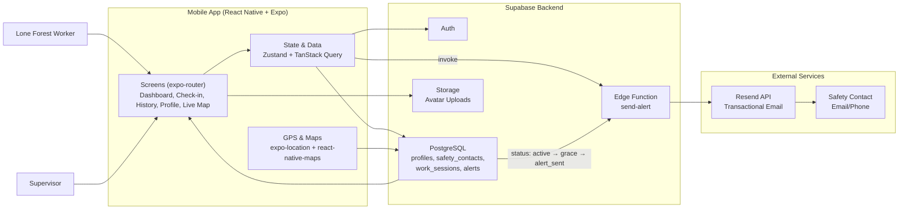

# SylvanShield
A mobile safety check-in app for lone forest workers in Finland. Workers start and end shifts via the app — if a worker fails to check out on time, the system automatically escalates through a grace period and sends an emergency alert to their designated safety contact after grace period.

Built as a learning project to understand the full product development lifecycle, from design to testing. AI-assisted development using Claude/Cursor.

## Demo

  

## Architecture

## Tech Stack
### Mobile
React Native + Expo SDK 55
TypeScript, NativeWind (Tailwind CSS)
TanStack Query, Zustand
react-native-maps, expo-location

### Backend
- Supabase (PostgreSQL, Auth, Storage, Edge Functions)
- Resend (transactional email)

### Testing
- [Manual Test Cases](docs/TESTCASES.md)(46 test cases across 8 modules)
- Jest unit tests (14 tests, useSessionStore state machine)
- [Robot Framework API tests](rfw-tests/README.md)
- CI via GitHub Actions

## Features
- Worker shift start/end with safety monitoring
- Automatic grace period and emergency email(phone) alert
- Supervisor dashboard with live worker status
- Real-time GPS tracking and live map
- Avatar upload via Supabase Storage

#### Disclaimer
This project is for learning purposes only and does not represent any real brand or organisation
